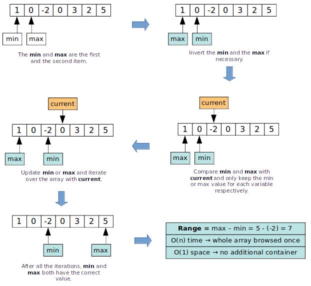

# rust-algorithms

## Table of content
 * [Get minimum value from array](#get-minimum-value-from-array) - O(n) time and O(1) space
 * [Get maximum value from array](#get-maximum-value-from-array) - O(n) time and O(1) space
 * [Get maximum range from array](#get-maximum-range-from-array) - O(n) time and O(1) space
 * [Get highest movement from array](#get-highest-movement-from-array) - O(n) time and O(1) space
 * [Get missing value from array](#get-missing-value-from-array) - O(n) time and O(1) space
 * [Product of all numbers except current one](#product-of-all-numbers-except-current-one) - O(n) time and O(n) space
 * [Get maximum product of three numbers from array](#get-maximum-product-of-three-numbers-from-array) - O(n) time and O(1) space
 * [Merge ranges](#merge-ranges) - O(n log2 n) time and O(n) space
 * [Get all sums amount](#get-all-sums-amount) - O(n * m) time (two different arrays are browsed) and O(n) space
 * [Get all sums](#get-all-sums) - O(n * m * o) time and O(n * m) space
 * [Get permutations with repetitions amount](#get-permutations-with-repetitions-amount) - O(1) time and O(1) space
 * [Get all permutations with repetitions](#get-all-permutations-with-repetitions) - O(n^n) time and O(n) space
 * [Factorial](#factorial) - O(n) time and O(1) space

## Create the container

```sh
vagrant up
```

## Connect to the container

```sh
vagrant ssh
```

## Build the library

```sh
cargo build --release
```

## Run the unit tests

```sh
cargo test
```

## Generate documentation

```sh
cargo rustdoc -- --no-defaults
```

## Implemented methods

### Get minimum value from array

O(n) time and O(1) space

```rust
let array: [u8; 5] = [4, 3, 6, 2, 3];
let minimum = min_value(&array); // 2
```

### Get maximum value from array

O(n) time and O(1) space

```rust
let array: [u8; 5] = [4, 3, 6, 2, 3];
let maximum = max_value(&array); // 6
```

### Get maximum range from array

Returns the highest distance possible between two numbers of the array, O(n) time and O(1) space.

```rust
let array: [u8; 7] = [0, 1, -2, 0, 3, 2, 5];
let max_distance = get_max_range(&array); // 7
```



### Get highest movement from array

Returns the highest variation from an array, O(n) time and O(1) space.

For example, taking the following array:

```
0 1 6 3 6 -1 0
```

The variations are:

```
0 to 6 -> 6
6 to 3 -> 3
3 to 6 -> 3
6 to -1 -> 7
-1 to 0 -> 1
```

```rust
let array: [u8; 7] = [0, 1, -2, 0, 3, 2, 5];
let max_distance = get_max_consecutive_range(&array); // 5
```

### Get missing value from array

Returns the missing value from an array of not ordered consecutive numbers, O(n) time and O(1) space.

```rust
let array: [u32; 4] = [4, 2, 1, 5];
let missing_value = get_missing_value(&array); // 3
```

### Product of all numbers except current one

Takes an array with numbers. Replace every number by the product of all the numbers of the array except the one currently at this array position.

The array is browsed two times so O(n) time, and a new array is created to store the result, so O(n) space.

```rust
let array: [u32; 4] = [2, 5, 3, 4];
let result = product_all_items_except_current(&array); // [60, 24, 40, 30]
```

### Get maximum product of three numbers from array

Returns the maximum product of three numbers from an array, taking O(n) time and O(1) space.

```rust
let array: [i32; 5] = [-4, 3, -2, -5, 6];
let max = get_max_product_of_three(&array); // -5 * -4 * 6 = 120
```

### Merge ranges

Merge array of ranges. A range is merged into the previous one if possible.

The array is first sorted. Using sort, the following time complexity occurs:
 * O(n log2 n)
 * O(n^2) if the array is totally reverted (worst case),
 * O(n) if the array is already ordered (best case),
so we considere the average case O(n log2 n) time complexity.

The result is stored into a new array, so the space complexity is O(n).

```rust
let ranges: [(i32, i32); 5] = [
    (4, 7),
    (3, 5),
    (8, 10),
    (2, 3),
    (-6, -3),
];

let result = get_merge_ranges(&ranges); // [(-6, -3), (2, 7), (8, 10)]
```

### Get all sums amount

Find the amount of possible sums to totalize the given amount
using only the given numbers (multiple time usage is allowed).

The time complexity is O(n * m) as two arrays of different content
are browsed (one with the possible numbers, one with the results).

The space complexity is O(n) as we have to create a new array
based on the given input.

```rust
let allowed_numbers: [u8; 3] = [2, 4, 5];
let amount: u32 = 15;

let sums_amount = get_sum_numbers_combinations_quantity_for_amount(
    &allowed_numbers,
    amount,
);

/* sums_amount = 4

   solutions:
   5, 5, 5
   2, 4, 4, 5
   2, 2, 2, 4, 5
   2, 2, 2, 2, 2, 5
*/
```

### Get all sums

Find the amount of sums to totalize the given amount
using only the given numbers (multiple time usage is allowed).

The time complexity is O(n * m * o) and the space complexity is O(n * m),
as two other arrays might be browsed and one array is created per original array value.

```rust
let allowed_numbers: [u8; 3] = [2, 4, 5];
let amount: u32 = 15;

let sums_amount = get_sum_numbers_combinations_for_amount(
    &allowed_numbers,
    amount,
);

/*
    [
        [5, 5, 5],
        [2, 4, 4, 5],
        [2, 2, 2, 4, 5],
        [2, 2, 2, 2, 2, 5],
    ]
*/
```

### Get permutations with repetitions amount

Returns all the possible permutations amount (with repetitions)
according to a total amount of items and an items amount to include into the selection.

The time is O(1) and the space is O(1), only the amount is calculated using the formula.

```
The amount of possible permutations (order matters) with repetitions for a total set of length n and a selection of length k is n^k.
```

```rust
let possible_permutations_amount = permutations_with_repetitions(10, 4); // 10000
```

### Get all permutations with repetitions
(handled by **get_all_permutations(array, selection, allow_repetition: true)**)

Returns all the possible permutations (with repetitions) of the given items from the array.

The time complexity is O(n^n) because we use a **depth-first search** algorithm
(that means we browse the recursion tree as deep as possible for one path, before backing up
and browsing another path).

A container with a size related to the input is created, so the space complexity is O(n).

```rust
let array: [u8; 2] = [1, 2];
let permutations = get_all_permutations(&array, 2, true);

/*
[1, 1],
[1, 2],
[2, 1],
[2, 2]
*/
```

This is also possible to define the size of all the returned permutations:

```rust
let array: [u8; 3] = [1, 2, 3];
let permutations = get_all_permutations_with_repetitions(&array, 2);

/*
[1, 1],
[1, 2],
[1, 3],
[2, 1],
[2, 2],
[2, 3],
[3, 1],
[3, 2],
[3, 3]
*/
```

### factorial(value)

Recursive factorial calculation.

O(n) time as the amount of recursion depends on the given input
(recursion occur as long as the input is not 1, started from the default input).

O(1) space as the result of the previous recursion is the input of the next one.

```rust
let result = factorial(4); // 24
```

### permutations_without_repetitions(total_amount, selection_amount)

Returns all the possible permutations amount without allowing repetitions,
according to a total amount of items and an items amount to include into the selection.

```
The amount of possible permutations (order matters) without repetitions for a total set of length n and a selection of length k is n!/(n-k)!.
```

```rust
let possible_permutations_amount = permutations_without_repetition(5, 2); // 60
```

### get_all_permutations_without_repetition(array)
(handled by **get_all_permutations(array, selection, allow_repetition: false)**)

Returns all the possible permutations without allowing repetitions.

```rust
let items: [u8; 2] = [1, 2];
let permutations = get_all_permutations_without_repetition(items);

/*
[1, 2]
[2, 1]
*/
```

### at_linked_list(list, index)

Returns the value at the given index from the given `LinkedListNode` item in O(n) time and O(1) space.

### fibonacci_recursive(index)

Returns the number at the given index into the Fibonacci serie.

```rust
let number = recursive_fibonacci(6); // 8 (0, 1, 1, 2, 3, 5, 8)
```

This solution has a **overlapping subproblem** issue and there is no **memoization** to handle it.
In the example above, the function `recursive_fibonacci(4)` is called multiple times and it will always return the same output.

The time complexity is O(2^n) because of the multiple recursions and the two calls at the end of the function. Exponential cost is worst than quadratic complexity.

### fibonacci_recursive_with_memoization(index)

Returns the number at the given index into the Fibonacci serie using memoization in order to prevent the overlapping subproblem.

```rust
let number = recursive_fibonacci_with_memoization(6); // 8 (0, 1, 1, 2, 3, 5, 8)
```

### fibonacci_with_bottom_up(index)

Returns the number at the given index into the Fibonacci serie using a bottom-up approach. The result is computed in O(n) time and O(1) space.

```rust
let number = fibonacci_with_bottom_up(10); // 55
```
